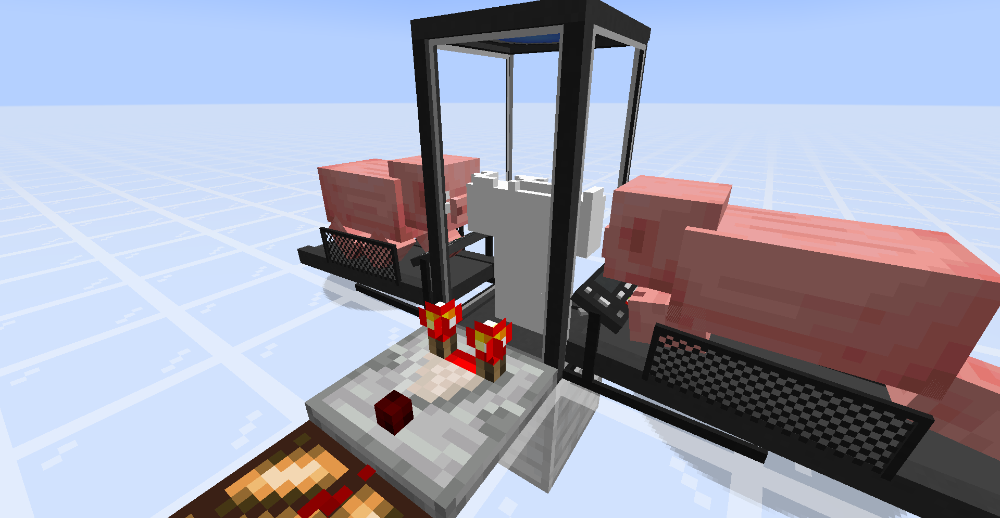
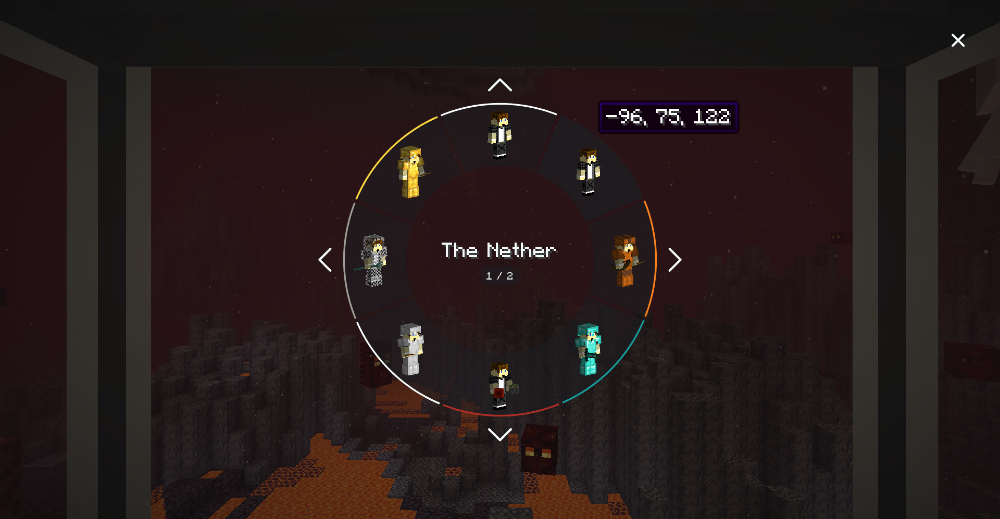

# NeoSync

> One mind. Many bodies.

NeoSync provides *shells*; clones of the player, each with their own inventory, experience, and gamemode, that you can transfer your consciousness into. This is a **NeoForge 1.21.1** port of the Fabric reimplementation by [Kir_Antipov](https://github.com/Kir-Antipov/sync-fabric), of the original [Sync](https://github.com/iChun/Sync) mod by [iChun](https://github.com/iChun).

----

## How to play

1. Craft a **shell constructor** and place it.
2. Right-click it with an empty hand to provide a genetic sample.
   > ⚠️ With default config this will **kill you** — 20 HP (40 in hardcore). Eat a golden apple for more health, hold a totem of undying, or enable `warnPlayerInsteadOfKilling` in the config.
3. Power the constructor: place a **treadmill** touching any side of it, lure a **pig** or **wolf** onto the front block, and piggawatts flow.

   

   > A comparator on the constructor tracks build progress.

4. Once the shell is built, craft a **shell storage**, place it, and supply redstone power (or FE from any tech mod).
5. When the storage doors open, walk in. A radial menu appears with your shells:

   

6. Pick a shell. Sync.

## Notes

- Right-click a shell storage with **dye** to color-code it.
- Syncing works cross-dimensional (custom dimensions supported).
- If you die in a shell, you auto-sync back to your original body, or to a random remaining shell if the original is gone. Shell deaths **don't** count towards your death counter.
- Hoppers connected to a shell storage can equip or unequip armor/tools on the stored shell.
- Shell storage needs continuous power to keep its shell alive (configurable); accepts redstone and/or FE.
- Comparator output from a shell container reports either *build progress* or *inventory fullness*. Right-click the container with a **wrench** (stick by default) to toggle.
- Shell containers are fragile — mine with **silk touch** to recover them.

## Config

Config file: `config/neosync-common.toml`. Key options:

| Key | Default | Effect |
| --- | --- | --- |
| `enableInstantShellConstruction` | `false` | Instant shell builds in creative |
| `warnPlayerInsteadOfKilling` | `false` | Don't kill low-HP players on fingerstick |
| `fingerstickDamage` / `hardcoreFingerstickDamage` | `20` / `40` | HP consumed per shell |
| `shellConstructorCapacity` | `256000` | FE needed for a full shell |
| `shellStorageCapacity` / `shellStorageConsumption` | `320` / `16` | FE buffer + per-tick drain keeping a shell alive |
| `shellStorageAcceptsRedstone` | `true` | Accept raw redstone as power |
| `shellStorageMaxUnpoweredLifespan` | `20` | Ticks a storage keeps its shell alive without power |
| `energyMap` | chicken=2, pig=16, player=20, wolf=22, villager=25, creeper=80, enderman=160 | FE/tick per entity on a treadmill |
| `syncPriority` | `NATURAL` | Which shell to pick on death. Values: `NATURAL`, `NEAREST`, or any dye color |
| `wrench` | `minecraft:stick` | Item that cycles a container's comparator output type |

## Mod integration

- **[JEI](https://www.curseforge.com/minecraft/mc-mods/jei)** — info descriptions on each sync block explaining the flow, plus a *Treadmill Energy Sources* category listing every entity the treadmill accepts and its FE/tick output (driven by `energyMap`).
- **[Jade](https://www.curseforge.com/minecraft/mc-mods/jade)** — crosshair tooltip for shell constructor / storage / treadmill showing owner, build progress, color, powered state, and energy level.

Both are optional; NeoSync runs fine without them.

## Installation

Requirements:
- Minecraft `1.21.1`
- NeoForge `21.1.x`

Grab the jar from a local `./gradlew build` (`build/libs/NeoSync-*.jar`) or a published release when available.

## License

MIT. Code by [Kir_Antipov](https://github.com/Kir-Antipov); NeoForge 1.21.1 port by BreakinBlocks. Original concept by [iChun](https://github.com/iChun). See [LICENSE](LICENSE) for details.
